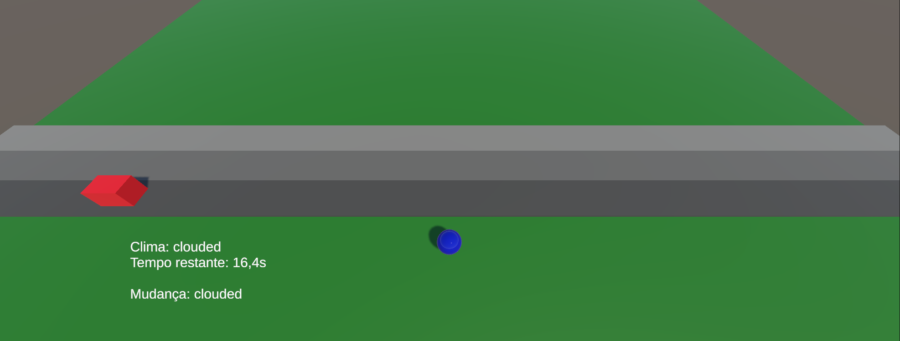
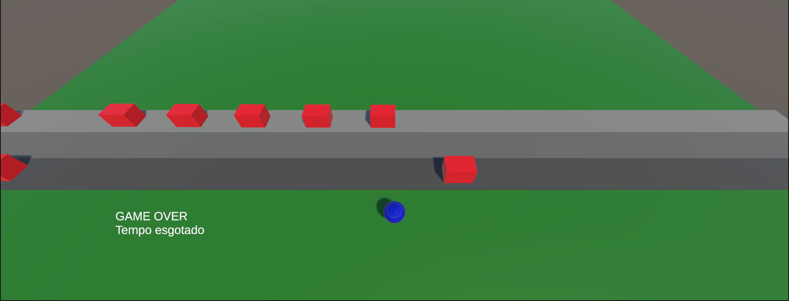
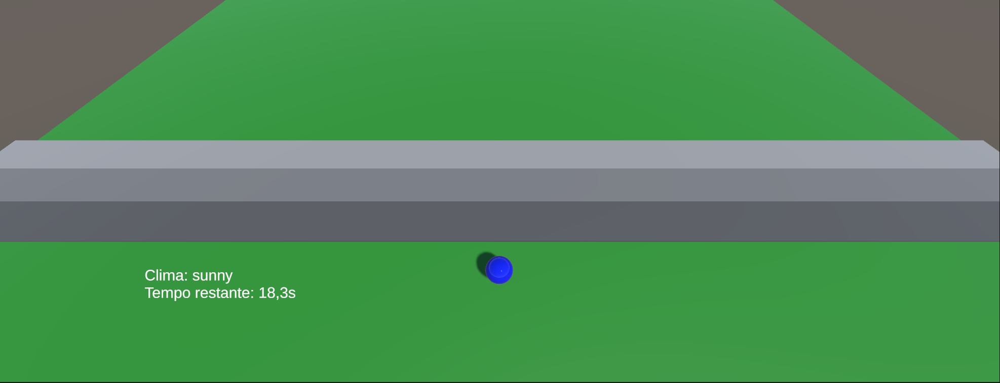
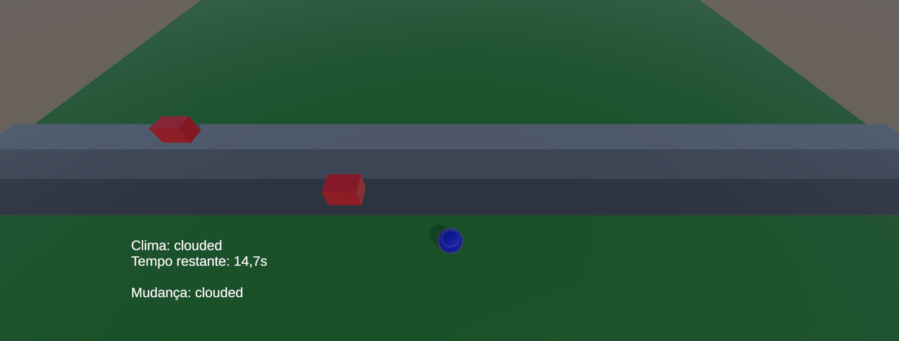
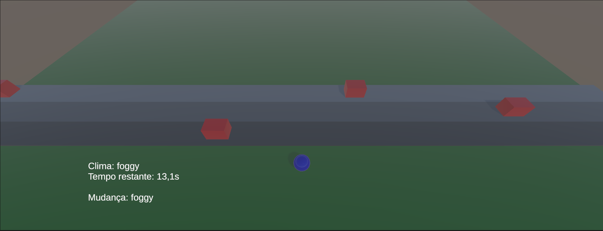
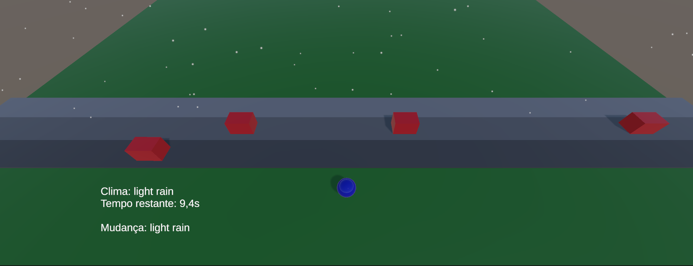
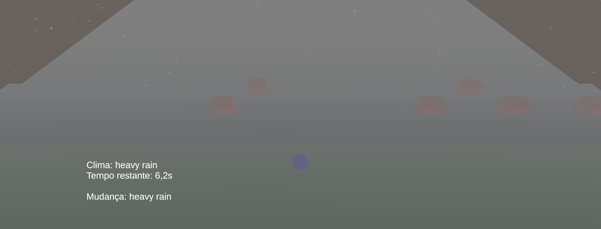

# 🚦 Traffic Simulation Game (Unity)

## 📄 Descrição

Este projeto é uma simulação interativa de tráfego desenvolvida em Unity, onde o jogador deve atravessar múltiplas faixas evitando veículos em movimento.

O comportamento do jogo é dinâmico e baseado em dados externos (JSON), simulando uma integração com API de tráfego em tempo real.

O sistema ajusta automaticamente:

* Densidade de veículos
* Velocidade dos carros
* Condições climáticas

Essas mudanças impactam diretamente a dificuldade do jogo ao longo do tempo.

---

## 🎮 Gameplay

* O jogador deve atravessar as faixas sem ser atingido
* O jogo possui contagem regressiva inicial
* O clima muda dinamicamente durante a partida
* A dificuldade aumenta com o tempo

### Condições de fim:

* 🏆 Vitória: atravessar todas as faixas
* 💥 Game Over: colisão com veículo
* ⏱️ Game Over: tempo esgotado

---

## 🌦️ Sistema de Clima

O jogo utiliza 5 estados climáticos:

* Sunny
* Clouded
* Foggy
* Light Rain
* Heavy Rain

Cada condição afeta diretamente a movimentação do jogador e a dinâmica do tráfego.

---

## 🧠 Arquitetura

O projeto foi estruturado com separação de responsabilidades:

* TrafficManager → controle central do jogo
* CarSpawner → geração de veículos
* CarController → movimento dos carros
* PlayerController → controle do jogador
* PlayerCollision → detecção de colisão
* HUDController → interface e mensagens

Essa organização facilita manutenção, leitura e escalabilidade.

---

## 🔄 Sistema de Dados

O jogo utiliza um arquivo JSON local para simular uma API de tráfego.

Esse arquivo define:

* Estado atual
* Predições futuras com base no tempo

As mudanças são aplicadas dinamicamente durante a execução do jogo.

---

## 🖥️ Interface (HUD)

O HUD exibe:

* Clima atual
* Tempo restante
* Mensagens dinâmicas

Inclui:

* Contagem regressiva inicial (3...2...1...VAI!)
* Mensagens de mudança de clima
* Feedback de vitória e game over

---

## ⚙️ Como Executar

1. Abra o projeto no Unity (versão recomendada: 2021+)
2. Abra a cena principal
3. Pressione Play

O arquivo JSON deve estar localizado em:

Assets/Resources/traffic.json

---

## 📁 Estrutura do Projeto

Assets/
├── Scripts/
├── Prefabs/
├── Resources/
│   └── traffic.json

---

## 💡 Decisões Técnicas

* Uso de JSON para simular API externa
* Uso de Coroutines para eventos baseados em tempo
* Separação clara de responsabilidades
* HUD com múltiplos estados (mensagem vs gameplay)
* Controle de fluxo com estados de jogo

---

## 🚀 Melhorias Futuras

* Animações no HUD
* Sons e efeitos visuais
* Sistema de pontuação
* Suporte a múltiplos níveis
* Integração com API real

## 📸 Preview

### Countdown

### Gameplay

### Game Over

### Sunny

### Clouded

### Foggy

### Light rain

### Heavy rain
